# Mobile Social Networking Application with React Native


## Project Introduction
We have built a mobile social networking application inspired by the Instagram platform. The app offers all the essential features of a social network, including posting, liking, sharing, commenting, and reporting posts. Additionally, users can follow others, send messages, display their activity status, and receive real-time notifications. Regarding the post reporting feature, we share the Admin Website with the [Web_Social_Network_with_Link_Prediction](https://github.com/NHViet03/Web_Social_Network_with_Link_Prediction)  project.
* This project is used to serve as a final term project for the course in the Information Systems department at UIT: Mobile Application Development - NT118 (9.5/10)

## Team Members

| ID        | Name         | Facebook                          | Contribution %  |
| :-------- | :----------- | :-------------------------------- | :-------------- |
| 21522791  | Nguyễn Hoàng Việt | [Nguyễn Hoàng Việt](https://www.facebook.com/NgyenHoangViet) | 100 |
| 21520400  | Nguyễn Hoàng Phúc | [Nguyễn Hoàng Phúc](https://www.facebook.com/hoangphucseiza) | 100 |

## Technologies Used
- **Frontend**: React Native, Redux, Expo Router, Tailwind CSS
- **Backend**: NodeJS, ExpressJS
- **Real-time**: Socket.IO
- **Database**: MongoDB
  
## Database Schema 
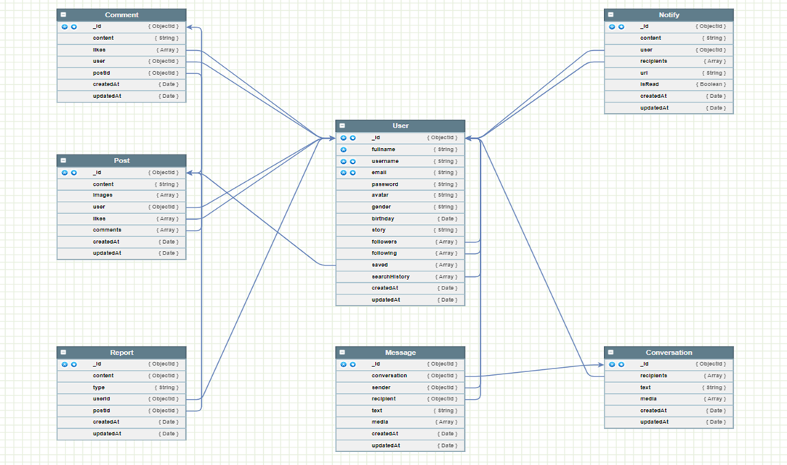

## Main Features of the Application
----------------
### Main Features for Users
> * Login / Register (API Token)
> * Create/Like/Comment/Share/Report Posts
> * Follow/Search/View Other Users' Profiles
> * Real-time Notifications/Messaging/Calling/Active Status
> * Manage Own Profile


## Demo of Some Interfaces
  
- Login & Register
<div float="left" align="center" >
  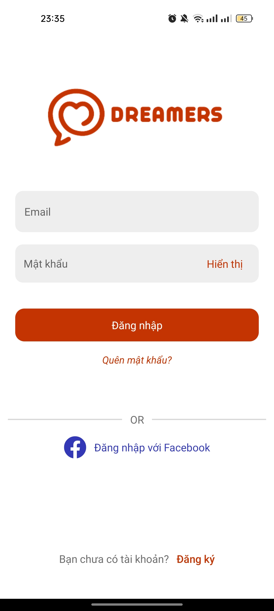
  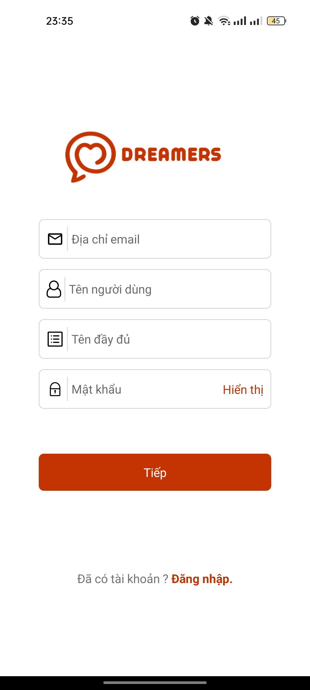 
  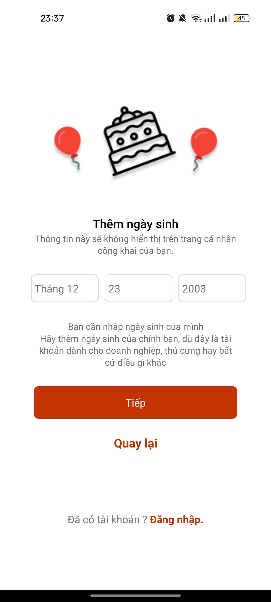
</div>


 - Home & Notification 
<div float="left" align="center" >
  
   
  
  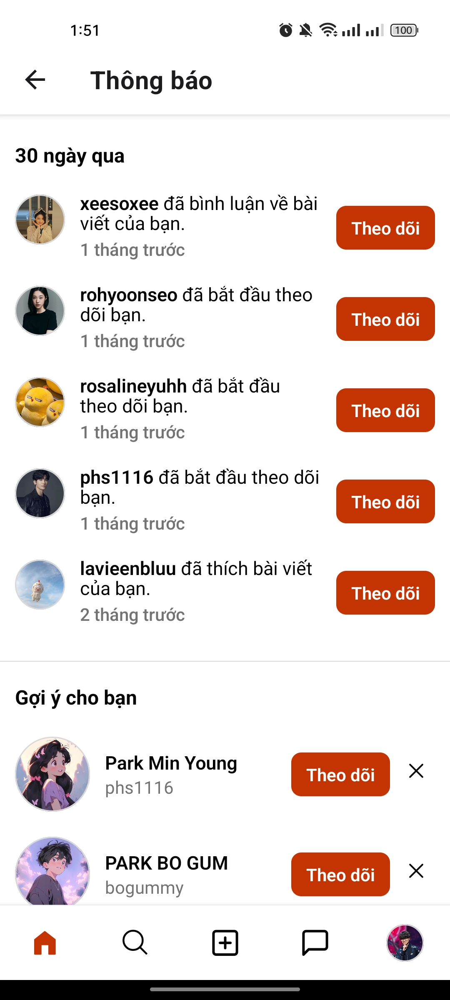
</div>

 - Create Post
<div float="left" align="center" >
  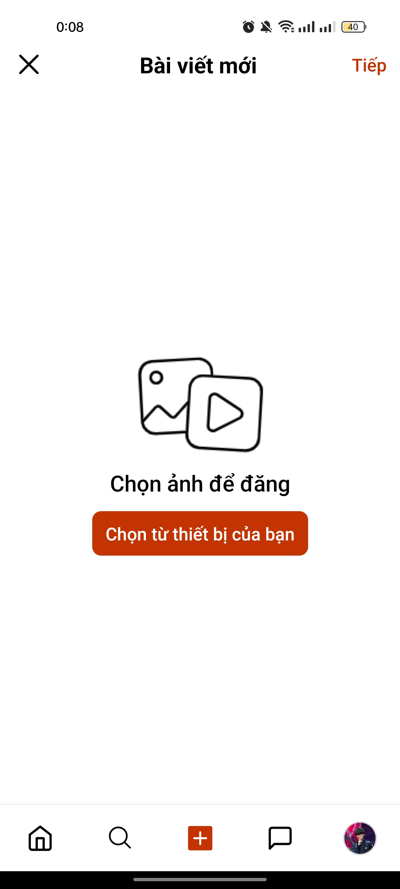
   
  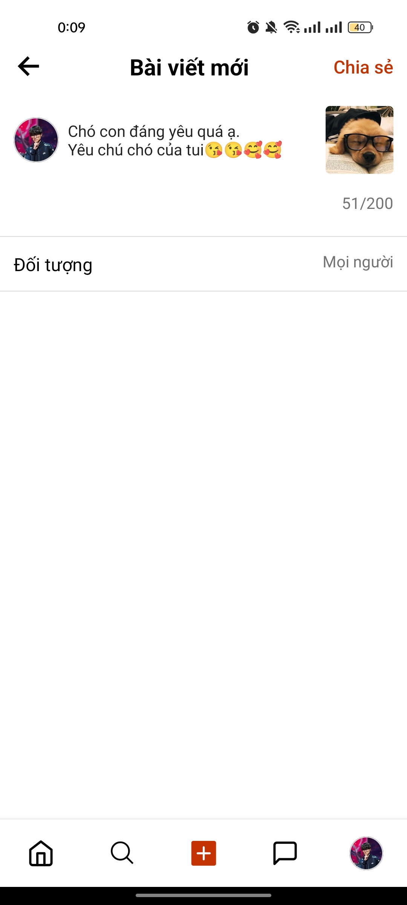
</div>

 - Post Management
<div float="left" align="center" >
  
  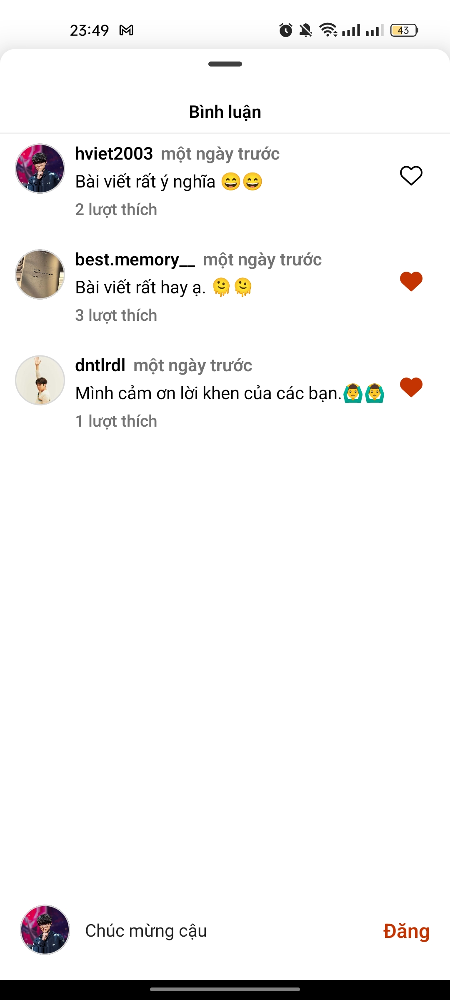 
  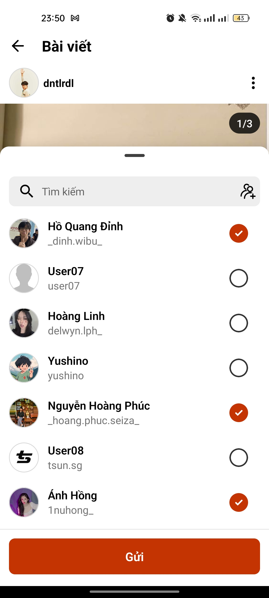
  
</div>

 - Explore & Search
<div float="left" align="center" >
  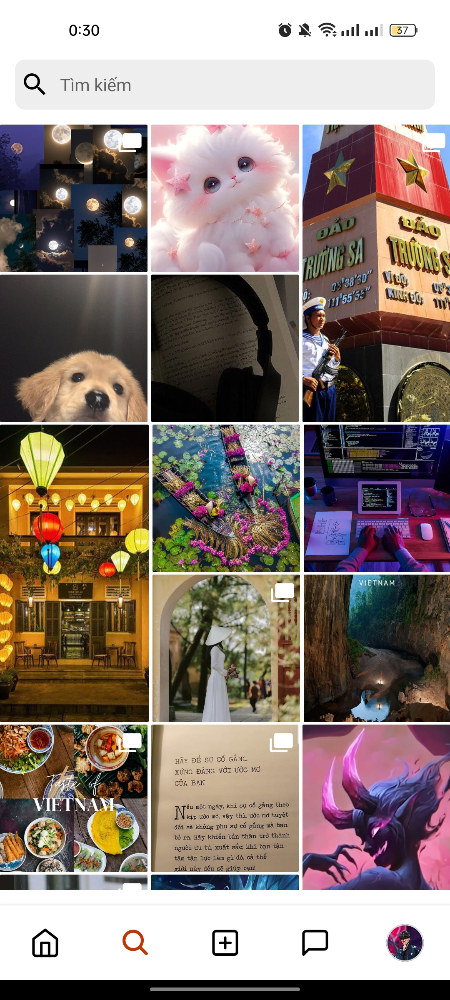
  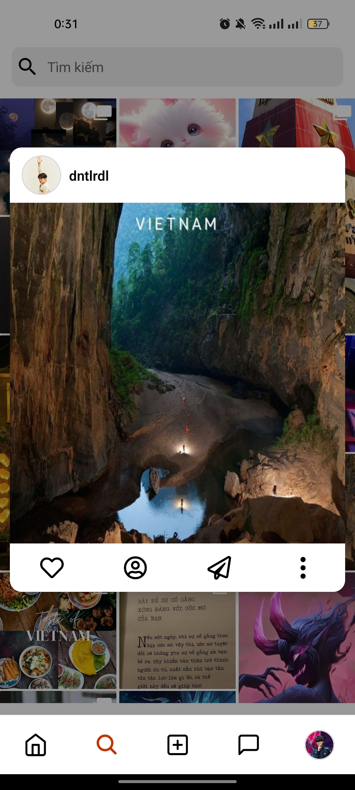 
  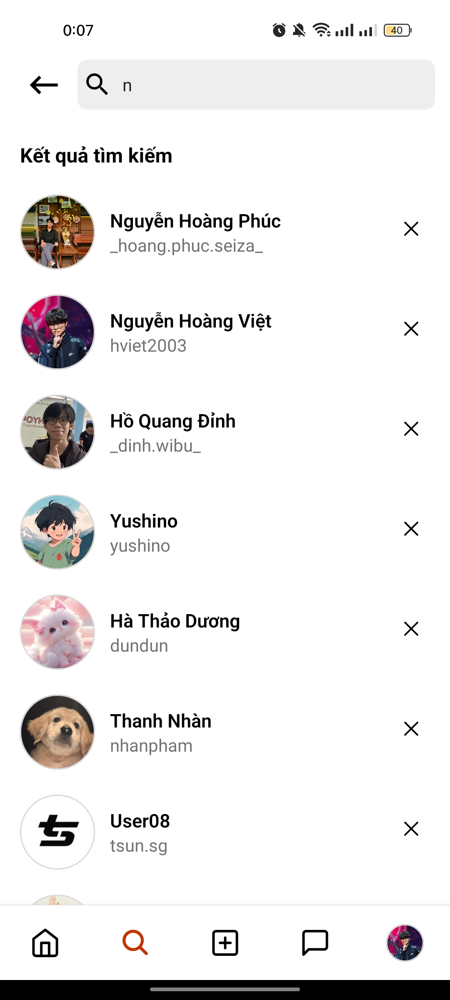
</div>

 - Messages & Active Status
<div float="left" align="center" >
  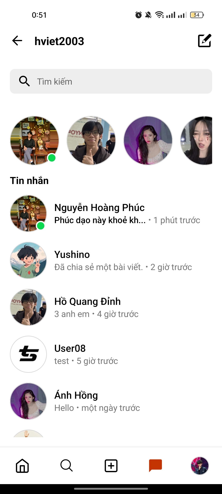
  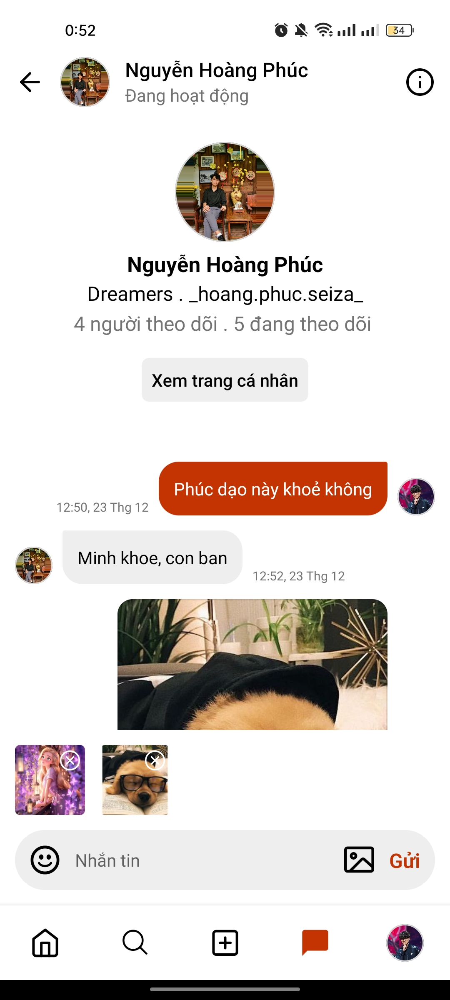 
  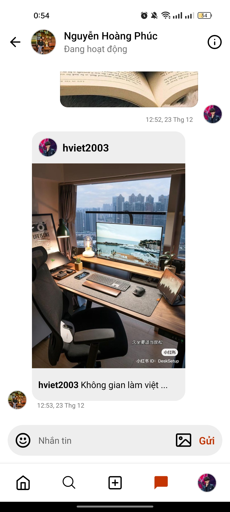
</div>

 - View & Manage Profile
<div float="left" align="center" >
  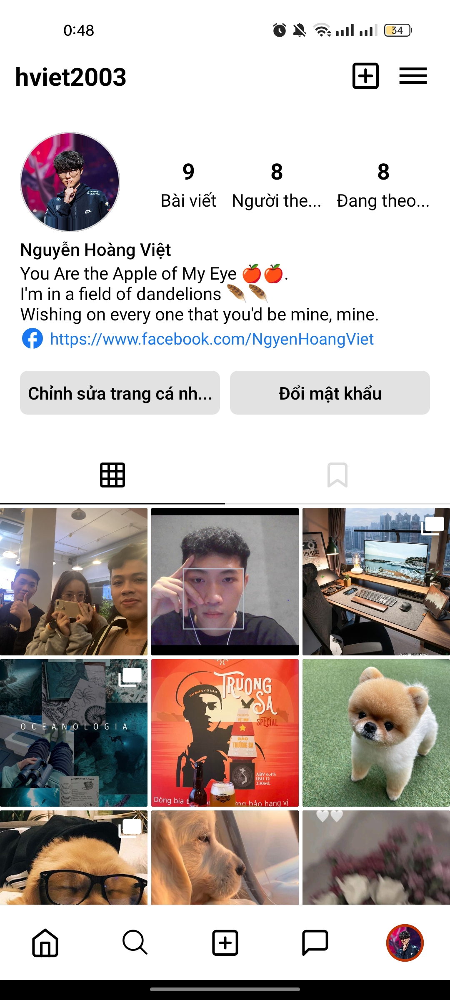
  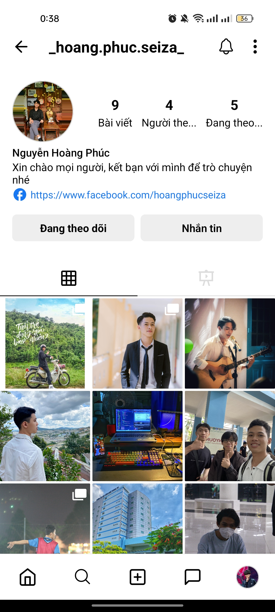 
  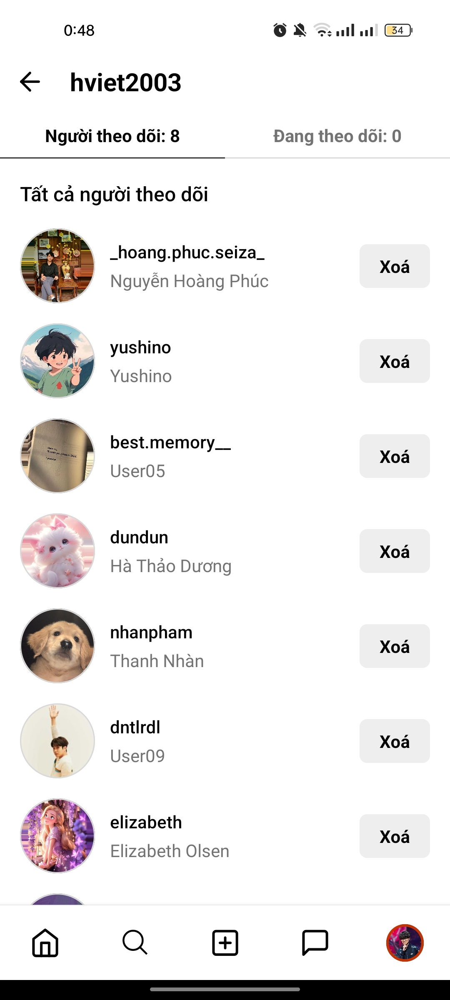
</div>

## Installation Guide

### Prerequisites
- Node.js (v14 or later)
- npm or yarn
- MongoDB Atlas Database
- Expo Go/Android Studio to run Virtual Machine

### Frontend Setup
1. **Clone the repository and navigate to the frontend directory:**
   ```bash
   git clone https://github.com/NHViet03/Mobile-App_Social_Network
   cd /Mobile-App_Social_Network/client
   
2. **Install dependencies:**
   ```bash
   npm install

3. **Start the Expo server:**
   ```bash
   npm start
   or
   npx expo start

### Backend Setup
1. **Navigate to the backend directory and Install dependencies:**
   ```bash
   cd /Mobile-App_Social_Network
   npm install

2. **Set up environment variables, create a .env file with:**
   ```bash
   MONGODB_URL=your_mongodb_connection_string
   ACCESS_TOKEN_SECRET=your_access_key
   REFRESH_TOKEN_SECRET=your_refresh_key

3. **Start the backend server:**
   ```bash
   npm start
*Note: After starting the backend server, proceed to start the Virtual Machine in Expo/Android Studio to launch the app.
## Related Project

- [Web_Social_Network_with_Link_Prediction](https://github.com/NHViet03/Web_Social_Network_with_Link_Prediction?tab=readme-ov-file)
